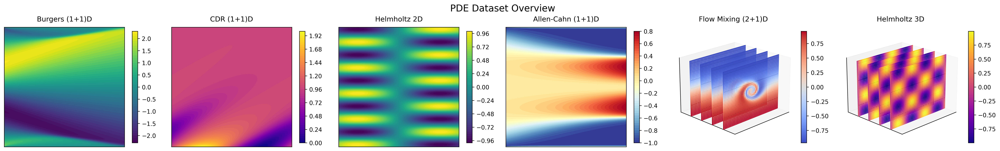

# Efficient Physics Learning Datasets



A JAX-based dataset utilities package for PDE (Partial Differential Equations) learning research.

## Overview

This repository provides tools and utilities for downloading, processing, and working with physics-informed machine learning datasets. It is designed to work seamlessly with JAX and Hugging Face's datasets library.

## What’s included

- **Dataset download** from Google Drive (via `gdown`)
- A **HuggingFace-like dataset API** for loading datasets from disk and creating:
  - **seeded training budgets** (e.g. 25/50/75 or any `n_train`)
  - **parametric interpolation vs extrapolation** splits for few-shot training
- **Plot smoke tests** (e.g. a 25-sample grid from the fixed test split)

## Available Datasets

| Dataset | Description |
|---------|-------------|
| `helmholtz2D` | 2D Helmholtz equation data |
| `helmholtz3D` | 3D Helmholtz equation data |
| `burgers` | Burgers equation data |
| `allen_cahn` | Allen-Cahn equation data |
| `flow_mixing` | Flow mixing simulation data |
| `convection` | Convection equation data |
| `hlrp_cdr` | HLRP Convection-Diffusion-Reaction data |
| `hlrp_convection` | HLRP Convection data |
| `hlrp_diffusion` | HLRP Diffusion data |
| `hlrp_helmholtz` | HLRP Helmholtz data |
| `hlrp_reaction` | HLRP Reaction data |

## Installation

This project uses [uv](https://github.com/astral-sh/uv) for package management.

```bash
# Clone the repository
git clone <repository-url>
cd eff-physics-learn-dataset

# Create environment and install dependencies
uv sync
```

## Usage

### Downloading Datasets

See the concise guide at `docs/download_datasets.md`.

List available datasets:
```bash
uv run python scripts/download_datasets.py --list
```

Download all datasets:
```bash
uv run python scripts/download_datasets.py
```

Download a specific dataset:
```bash
uv run python scripts/download_datasets.py -d helmholtz2D
```

Download to a custom directory:
```bash
uv run python scripts/download_datasets.py -o /path/to/datasets -d burgers
```

### Using the Shell Script

```bash
# Make the script executable
chmod +x scripts/download_datasets.sh

# Run it
./scripts/download_datasets.sh --list
./scripts/download_datasets.sh -d helmholtz2D
```

### HuggingFace-like dataset API

See `docs/dataset_api.md` for full examples.

Load a dataset:

```python
from eff_physics_learn_dataset.datasets import load_pde_dataset

ds = load_pde_dataset("helmholtz2D")  # e.g. "burgers", "flow_mixing", "helmholtz3D"
print(len(ds), ds.param_names, ds.u.shape)
sample = ds[0]
print(sample["u"].shape, sample["param_dict"])
```

Standard modality: **seeded budgets + fixed test split** (`test_indices.pkl`):

```python
splits = ds.budget_split("low", seed=0)  # low=25, medium=50, high=75
train, test = splits["train"], splits["test"]
print(len(train), len(test))
```

Parametric modality: **few-shot + interpolation vs extrapolation** (convex hull in parameter space):

```python
ps = ds.parametric_splits(seed=0, n_train=10)
print(len(ps["train_few"]), len(ps["interp"]), len(ps["extrap"]))
```

### Plot smoke tests

Generate a 25-sample plot for a dataset split:

```bash
uv run python scripts/plot_dataset_samples.py -e helmholtz2D -s test --n 25
```

### Results folder

By default, plot/report scripts write to:

`docs/_assets/results/{equation}/`

You can override with `--out-dir`.

For datasets with an extra dimension (e.g. 2D+1 time series or 3D volumes), the plotter will
plot a **2D slice** by default (middle slice). You can override:

```bash
uv run python scripts/plot_dataset_samples.py -e flow_mixing -s test --n 25 --slice-index 0
uv run python scripts/plot_dataset_samples.py -e helmholtz3D -s test --n 25 --slice-index 32
```

## Dependencies

- **JAX/JAXLib**: High-performance numerical computing
- **Hugging Face Datasets**: Dataset loading and processing
- **gdown**: Google Drive file downloads
- **NumPy/SciPy**: Numerical operations
- **h5py**: HDF5 file support
- **matplotlib**: Plot smoke tests

## Project Structure

```
eff-physics-learn-dataset/
├── configs/
│   └── datasets/
│       └── dataset_links.toml    # Dataset Google Drive IDs
├── docs/
│   ├── download_datasets.md      # Download usage guide
│   └── dataset_api.md            # HF-like dataset API guide
├── scripts/
│   ├── download_datasets.py      # Python download script
│   └── download_datasets.sh      # Shell wrapper
│   └── plot_dataset_samples.py   # Plot a 25-sample grid (smoke test)
├── src/
│   └── eff_physics_learn_dataset/
│       └── datasets/             # HF-like dataset API
├── pyproject.toml               # Project configuration
└── README.md
```

## License

MIT License - See [LICENSE](LICENSE) for details.

