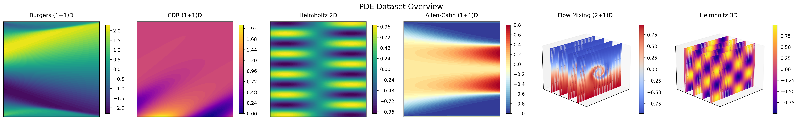

# Efficient Physics Learning Datasets



A lightweight dataset utilities package for PDE (Partial Differential Equations) learning research.

## Overview

This repository provides tools and utilities for downloading, processing, and working with physics-informed machine learning datasets. It is designed to be lightweight and have minimal runtime dependencies.

## What’s included

- **Dataset download** from Google Drive (via `gdown`)
- A **HuggingFace-like dataset API** for loading datasets from disk and creating:
  - **seeded training budgets** (e.g. 25/50/75 or any `n_train`)
  - **parametric interpolation vs extrapolation** splits for few-shot training
- **Plot smoke tests** (e.g. a 25-sample grid from the fixed test split)

## Available Datasets

| Dataset | Description |
|---------|-------------|
| `helmholtz2D` | 2D Helmholtz equation data |
| `helmholtz3D` | 3D Helmholtz equation data |
| `burgers` | Burgers equation data |
| `allen_cahn` | Allen-Cahn equation data |
| `flow_mixing` | Flow mixing simulation data |
| `convection` | Convection equation data |
| `hlrp_cdr` | HLRP Convection-Diffusion-Reaction data |
| `hlrp_convection` | HLRP Convection data |
| `hlrp_diffusion` | HLRP Diffusion data |
| `hlrp_helmholtz` | HLRP Helmholtz data |
| `hlrp_reaction` | HLRP Reaction data |

## Installation

This project uses [uv](https://github.com/astral-sh/uv) for package management.

```bash
# Clone the repository
git clone <repository-url>
cd eff-physics-learn-dataset

# Create environment and install dependencies
uv sync
```

If you want to import `eff_physics_learn_dataset` from *outside* the repo (recommended), install it in editable mode:

```bash
uv pip install -e .
```

## Usage

### Downloading Datasets

See the concise guide at `docs/download_datasets.md`.

List available datasets:
```bash
uv run python scripts/download_datasets.py --list
```

Download all datasets:
```bash
uv run python scripts/download_datasets.py
```

Download a specific dataset:
```bash
uv run python scripts/download_datasets.py -d helmholtz2D
```

### Loading datasets (library API)

The main entrypoint is the lightweight “HF-like” dataset wrapper.

```python
from eff_physics_learn_dataset import load_pde_dataset

# Default: looks under ./datasets/{equation}/ground_truth/
ds = load_pde_dataset("helmholtz2D")
print(len(ds), ds.param_names, ds.u.shape)

sample = ds[0]
print(sample["u"].shape, sample["param_dict"])
```

Load from a custom datasets directory (e.g. if you downloaded to `/path/to/datasets`):

```python
from eff_physics_learn_dataset import load_pde_dataset

ds = load_pde_dataset("burgers", data_dir="/path/to/datasets")
```

### Train/test and parametric splits

Standard modality: **seeded budgets + fixed test split** (`test_indices.pkl`):

```python
splits = ds.budget_split("low", seed=0)  # low=25, medium=50, high=75 (or pass an int)
train, test = splits["train"], splits["test"]
print(len(train), len(test))
```

Parametric modality: **few-shot + interpolation vs extrapolation**:

```python
ps = ds.parametric_splits(seed=0, n_train=10)
print(len(ps["train_few"]), len(ps["interp"]), len(ps["extrap"]))
```

### Using the Shell Script

```bash
# Make the script executable
chmod +x scripts/download_datasets.sh

# Run it
./scripts/download_datasets.sh --list
./scripts/download_datasets.sh -d helmholtz2D
```

### HuggingFace-like dataset API

See `docs/dataset_api.md` for full examples.

### Using the solvers (optional: ground-truth generation)

This repo also includes lightweight solver modules under `src/solvers/` that can be used to generate single PDE solutions (useful for debugging, demos, or for building your own dataset generator).

Examples:

```python
from solvers.ks import generate_ks_sample

u, x, t, ok, metrics = generate_ks_sample(
    alpha=1.10,
    beta=1.20,
    gamma=1.20,
    solver_nx=256,
    solver_nt=601,
    target_nx=64,
    target_nt=64,
)
print(u.shape, ok, metrics)
```

```python
from solvers.wave2d1 import generate_wave2d1_sample

u, x, y, t, ok, metrics = generate_wave2d1_sample(
    c0=1.0,
    velocity_type="constant",
    solver_nx=160,
    solver_ny=160,
    t_steps=220,
    target_nx=64,
    target_ny=64,
    target_nt=64,
)
print(u.shape, ok, metrics)
```

Quick visualization examples:

```python
# Wave2D: show a few time slices (u has shape (T, X, Y))
import matplotlib.pyplot as plt
import numpy as np

from solvers.wave2d1 import generate_wave2d1_sample
from plotting import plot_solution_rows

u, x, y, t, ok, metrics = generate_wave2d1_sample()

num_cols = 3
slice_indices = np.linspace(0, u.shape[0] - 1, num_cols, dtype=int)
sol = u[slice_indices]  # (3, X, Y)

plot_solution_rows(
    solutions_by_split={"wave2d": sol},
    n_per_row=num_cols,
    plot_style="contourf",
    contour_levels=20,
    contour_line_color="black",
    extent=(x.min(), x.max(), y.min(), y.max()),
    show_axes=True,
    colorbar_uniform=True,
    title="2D wave: three time slices",
)
plt.show()
```

For runnable notebook examples, see:
- `scripts/examples/solver_burgers_example.ipynb`
- `scripts/examples/solver_wave_example.ipynb`
- `scripts/examples/solver_ks_example.ipynb`

### Plot smoke tests

Generate a 25-sample plot for a dataset split:

```bash
uv run python scripts/plot_dataset_samples.py -e helmholtz2D -s test --n 25
```

### Results folder

By default, plot/report scripts write to:

`docs/_assets/results/{equation}/`

You can override with `--out-dir`.

For datasets with an extra dimension (e.g. 2D+1 time series or 3D volumes), the plotter will
plot a **2D slice** by default (middle slice). You can override:

```bash
uv run python scripts/plot_dataset_samples.py -e flow_mixing -s test --n 25 --slice-index 0
uv run python scripts/plot_dataset_samples.py -e helmholtz3D -s test --n 25 --slice-index 32
```

## Dependencies

- **NumPy/SciPy**: Numerical operations
- **gdown**: Google Drive file downloads
- **matplotlib**: Plot smoke tests
- **tomli / tomli-w**: TOML configuration I/O
- **JAX/JAXLib + h5py** (optional, via `generation` extra): dataset generation solvers

## Project Structure

```
eff-physics-learn-dataset/
├── configs/
│   └── datasets/
│       └── dataset_links.toml    # Dataset Google Drive IDs
├── docs/
│   ├── download_datasets.md      # Download usage guide
│   └── dataset_api.md            # HF-like dataset API guide
├── scripts/
│   ├── download_datasets.py      # Python download script
│   ├── download_datasets.sh      # Shell wrapper
│   ├── plot_dataset_samples.py   # Plot a 25-sample grid (smoke test)
│   ├── plot_param_splits.py      # Plot param-space distributions
│   └── solution_similarity_report.py  # Solution-space diagnostics
├── src/
│   ├── eff_physics_learn_dataset.py  # Public API shim (importable module)
│   ├── dataset.py                # PDEDataset + load_pde_dataset
│   ├── download.py               # Dataset downloading
│   ├── plotting.py               # Plot utilities
│   ├── similarity.py             # Solution-space PCA/similarity helpers
│   ├── splitting.py              # Parametric splitting helpers
│   ├── verification.py           # PDE-specific verification utilities
│   └── solvers/                  # Lightweight solver modules (optional)
├── pyproject.toml               # Project configuration
└── README.md
```

## Cite (if useful)

```bibtex
@article{torresamortized,
  title={Amortized Physics-Informed Learning via Generative Initialization of Radial Basis Functions},
  author={Torres, Edgar and Niepert, Mathias}
}

@misc{torres2025adaptivephysicsinformedneuralnetworks,
      title={Adaptive Physics-informed Neural Networks: A Survey}, 
      author={Edgar Torres and Jonathan Schiefer and Mathias Niepert},
      year={2025},
      eprint={2503.18181},
      archivePrefix={arXiv},
      primaryClass={cs.LG},
      url={https://arxiv.org/abs/2503.18181}, 
}
```

## License

MIT License - See [LICENSE](LICENSE) for details.

