# Parametric Split Visualizations

All visualizations generated using **solution_percentile** method (default).

## Configuration
- Method: `solution_percentile` (distance-based splitting in solution space)
- n_train: 10 samples
- balance: True
- n_each: 20 samples per split (interp/extrap)
- Seeds: 0, 1, 2

---

## Allen-Cahn (2D: eps, lam)

**Average separation: 5.58x** ⭐⭐ Excellent

### Visualizations
- 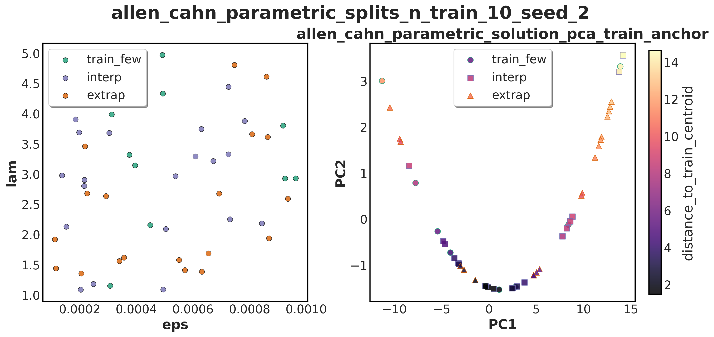
- 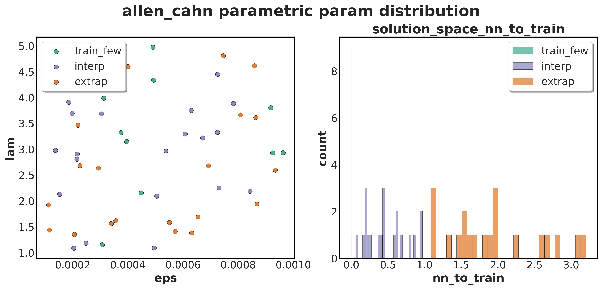
- 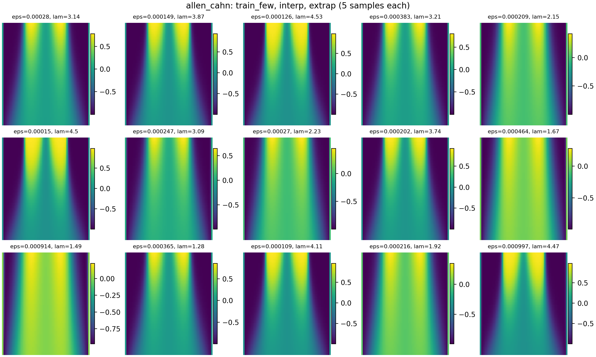
- 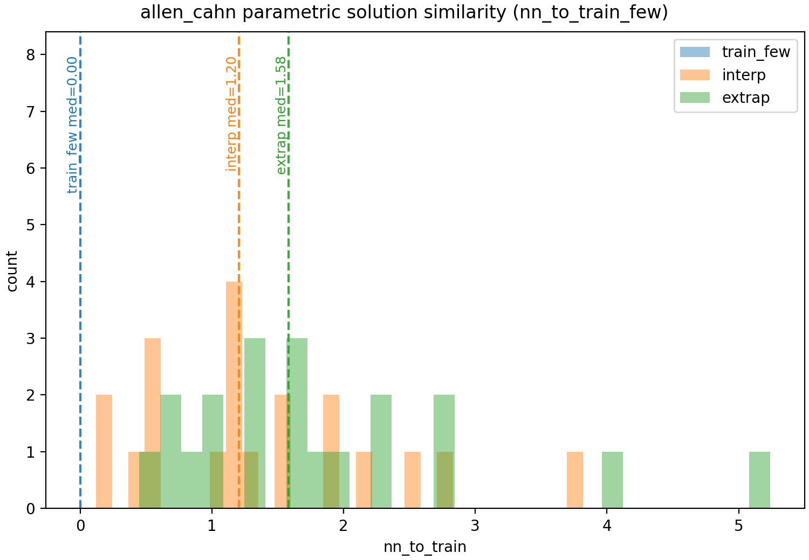

---

## Burgers (3D: A, k, nu)

**Average separation: 2.40x** ⭐ Good

### Visualizations
- 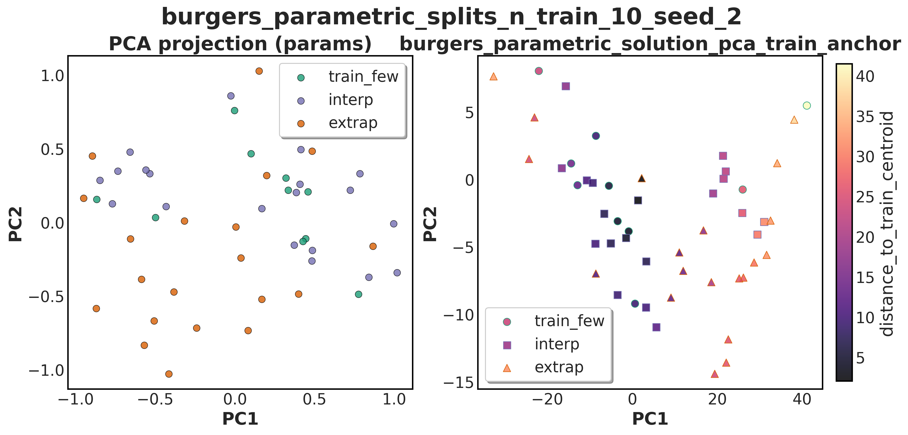
- 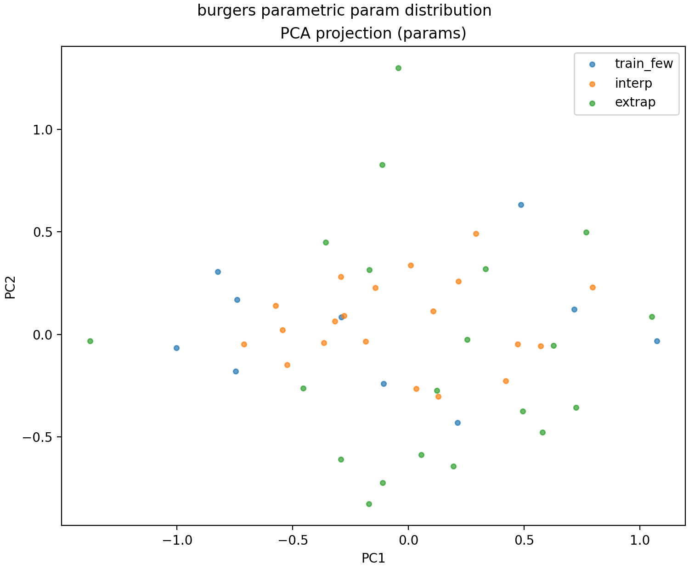
- 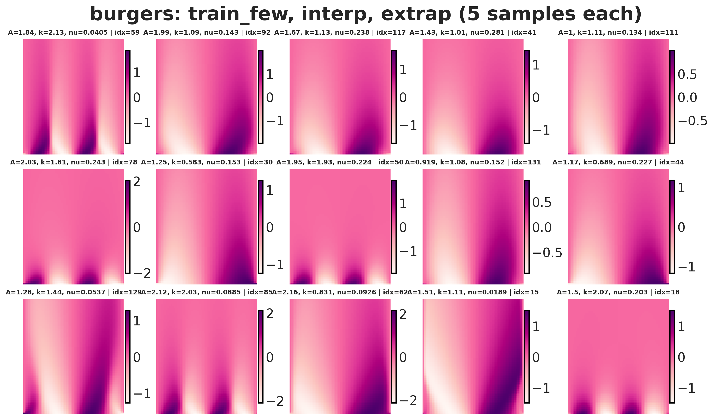
- 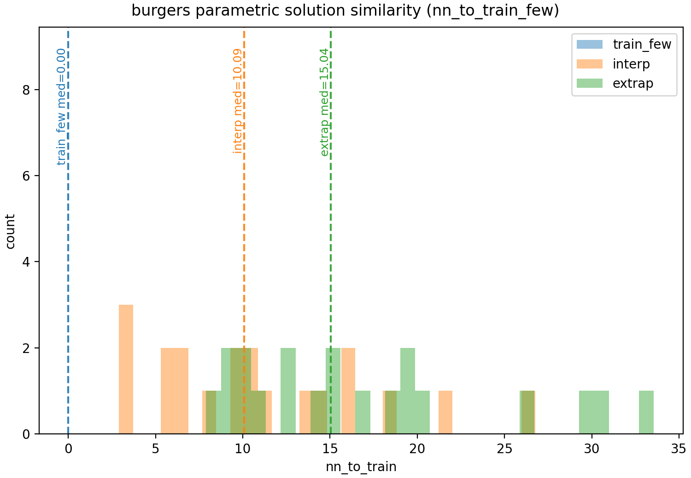

---

## Convection (1D: beta)

**Average separation: 3.65x** ⭐⭐ Excellent

### Visualizations
- 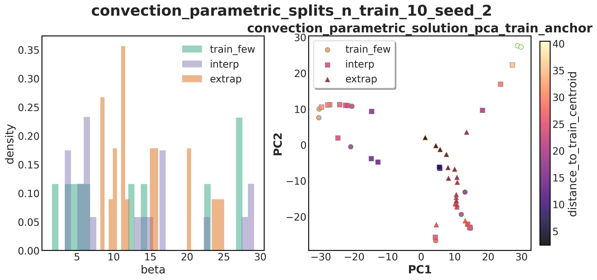
- 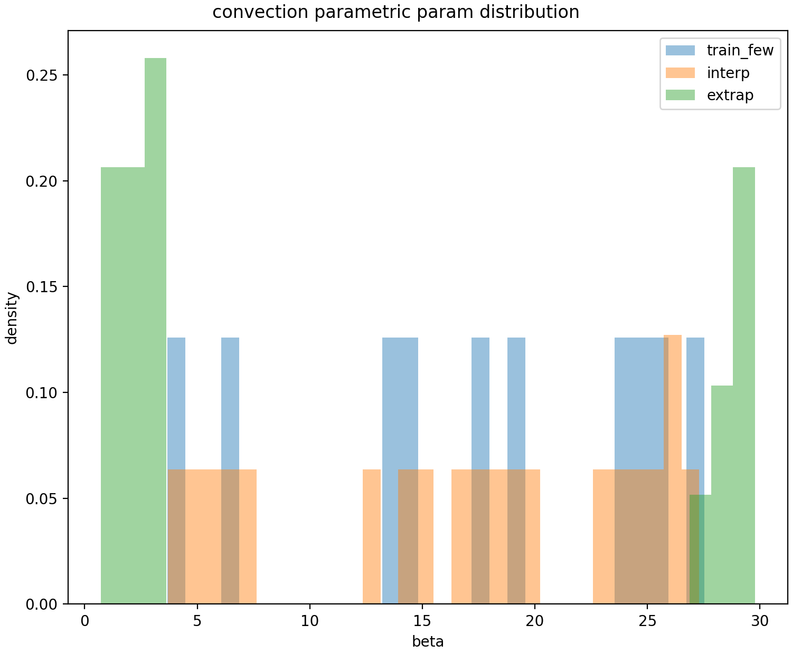
- 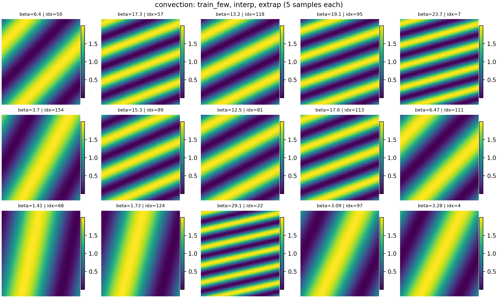
- 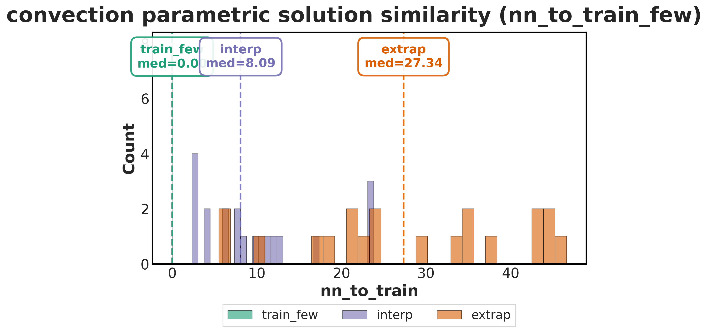

---

## Helmholtz2D (3D: a1, a2, k)

**Average separation: 1.91x** ✓ Acceptable

### Visualizations
- 
- 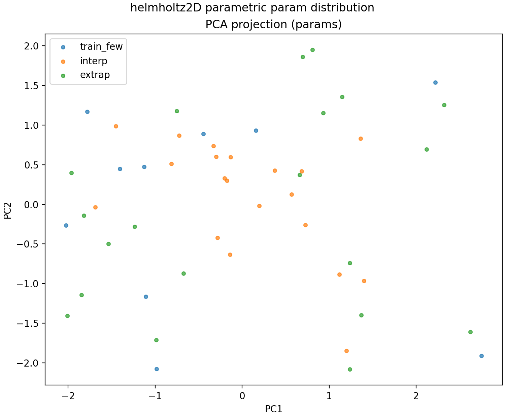
- 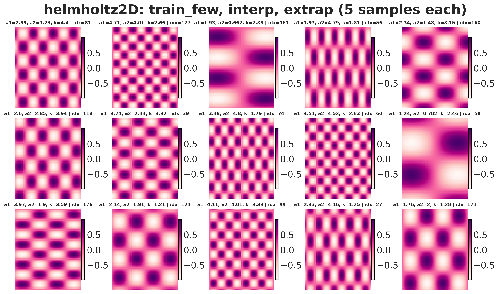
- 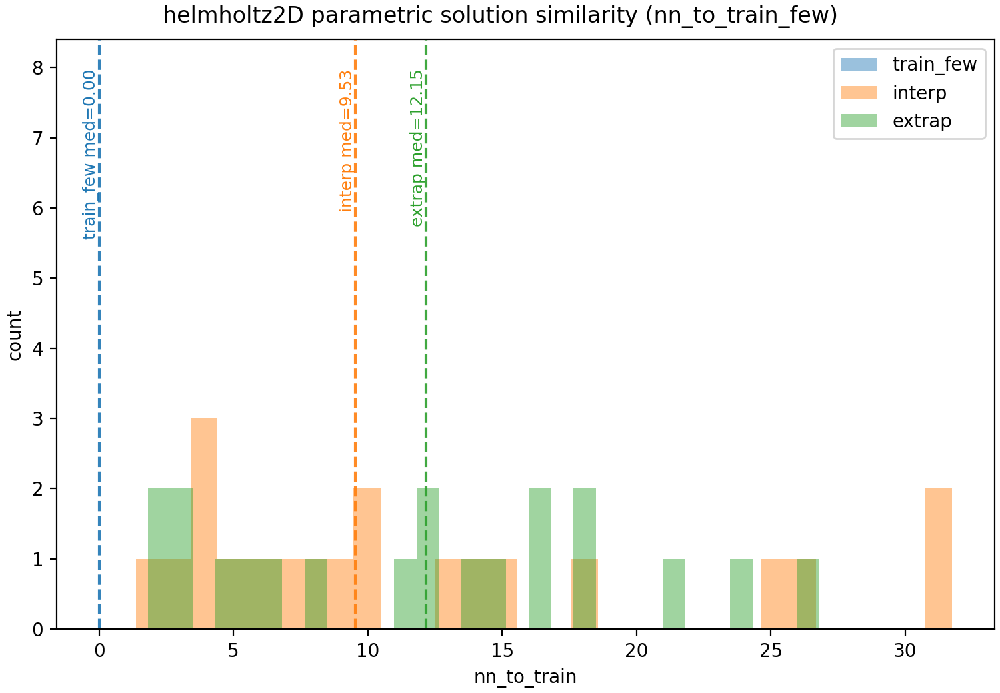

---

## Plot Types

### 1. Parameter Space Scatter (`*_parametric_params.png`)
Shows the distribution of train/interp/extrap samples in parameter space. For multi-parameter datasets, uses PCA projection.

### 2. Parameter + Distance Histogram (`*_parametric_param_scatter.png`)
Combines parameter space visualization with histograms showing the distribution of distances to training samples.

### 3. Solution Rows (`*_parametric_solution_rows.png`)
Visual comparison of solution fields from train/interp/extrap splits. Shows 5 representative samples per split.

### 4. Distance Histograms (`*_parametric_solution_similarity.png`)
Distribution of nearest-neighbor distances in solution-space PCA. Shows clear separation between interp and extrap splits.

---

## Python API Usage

```python
from eff_physics_learn_dataset import load_pde_dataset

# Load dataset
ds = load_pde_dataset("convection")

# Get parametric splits with solution_percentile method (default)
splits = ds.parametric_splits(
    seed=0,
    n_train=10,
    balance=True,
    n_each=20
)

# Access splits
train_ds = splits["train_few"]  # 10 training samples
interp_ds = splits["interp"]     # 20 interpolation samples (easier)
extrap_ds = splits["extrap"]     # 20 extrapolation samples (harder)

# Use in training
for sample in train_ds:
    u = sample["u"]              # Solution field (e.g., 64x64 array)
    params = sample["params"]    # Parameter vector
    param_dict = sample["param_dict"]  # Named parameters
```

## Regeneration

To regenerate all plots:

```bash
bash regenerate_all_splits.sh
```

Or for individual datasets:

```bash
# Solution similarity + distance histograms
python scripts/solution_similarity_report.py -e convection --seed 0 --n-train 10 --balance --n-each 20

# Parameter space scatter
python scripts/plot_param_splits.py -e convection --seed 0 --n-train 10 --mode parametric --balance --n-each 20
```
